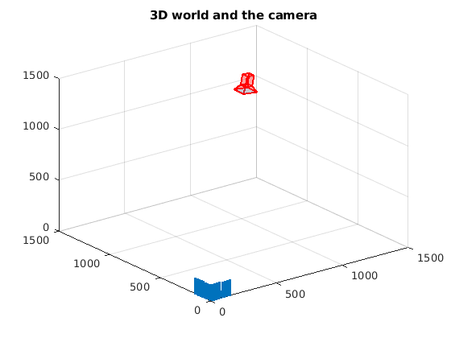
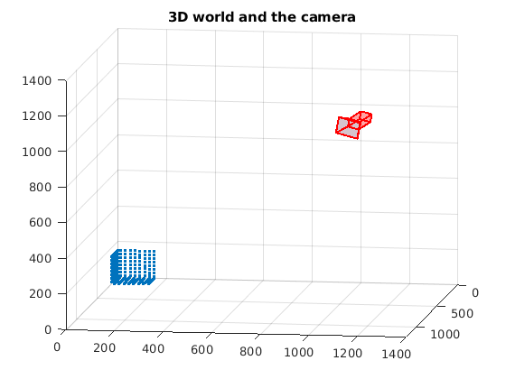
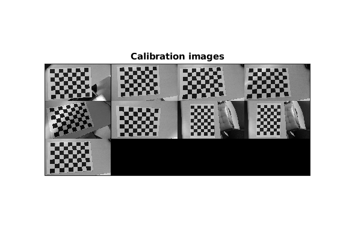
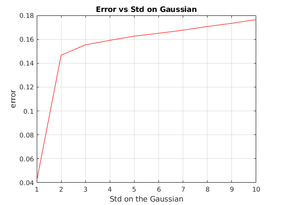
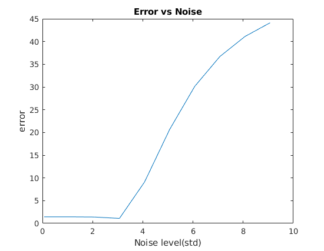
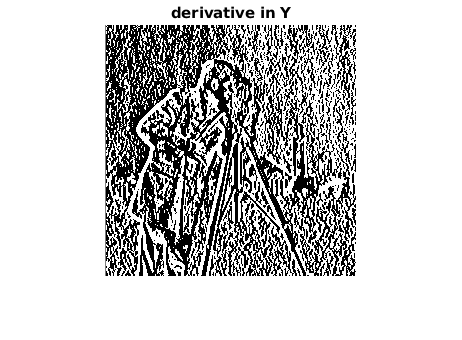

This repository contains my Lab and Practical work for my course on Visual Perception in Master of computer vision at Université de Bourgogne. The course was taught by Prof David Fofi and Devesh Adlakha. 

Instruction on the Lab can be found [here](https://coda.io/@devesh-adlakha/lab-exercises) and Lecture can be found [here](https://www.notion.so/vibot/Online-class-b5dc786be21044dfada8ebbadf27f68f).Please Take permission from the corrosponding autors if you will you use any of the lab instruction or lectures.

Lab Report can be found here [Report-1](Lab/Shriarulmozhivarman_Multi_View_Geometry_Lab_Report.pdf) (Lab-1,Lab-3) and [Report-2](Lab/Shriarulmozhivarman_Multi_View_Geometry_Lab_part_2.pdf) (Lab-2,Lab-4).

Practical Exercise Report can be found here [Report-1](TP/TP1_shriarulmozhivarman/Visual_Perception_TP.pdf)and [Report-2](TP/TP2_shriarulmozhivarman/Visual_Perception_TP_2.pdf).

Lab-1 Camera Calibrarion with DLT.  [matlabcode](Lab/Lab-1-camera-calibrarion-DLT/lab1.m)

**Objective** : The goal of this lab exercise is to understand and implement the DLT algorithm for camera calibration. 

  
   
   
   3D world for Camera Calibration.

 

  
   
   
   DLT for QR Decomposition and Cholesky factorization

 

Lab-2 Zhang Camera Calibration. [matlabcode](Lab/Lab-2-Zhang/lab2_withnoise.m)

**Objective** : The goal of this lab exercise is to understand and implement Zhang’s plane-based calibration method. You will test your implementation using simulated data. In the process, you will become more comfortable with developing and solving a linear system of equations, a process that is regularly used to solve computer vision problems. 

  
   
   
   Comparing Atucal Image and Randomely generated Noise image

 

  
   
   
  Comparing Atucal Image and Randomely generated Noise image

 

Lab-3 Bouguet Toolbox for Matlab. [matlabcode](Lab/Lab-3-Camera-Calibration-Toolbox-for-Matlab/Photos)

**Objective** : The goal of this lab exercise is to become familiar with the camera calibration process in practice by using Bouguet’s toolbox. The practical experience in calibrating your camera will solidify your understanding of Zhang’s method as well as of the different processing steps involved (corner detection, estimating distortion parameters, optimization of the parameters, etc.).  

  
   
   
   Bouguet Toolbox for Camera Calibration.

  
   
   
   Bouguet Toolbox for Camera Calibration.

  
   
   
   Bouguet Toolbox for Camera Calibration.

Lab-4 Fundamental Matrix. [matlabcode](Lab/Lab-4-Fundamental-Matrix/lab4.m)

**Objective** : The goal of this lab exercise is to understand and implement the normalized 8-point algorithm to linearly estimate the Fundamental matrix relating two images. Simulated data is provided for you to test your implementation and conduct further experiments. 

  
   
   
   Bouguet Toolbox for Camera Calibration.

Practical Exercise-1 Triangulation. [matlabcode](TP/TP1_shriarulmozhivarman/triangulation_ex.m)

  
   
   
   Triangulation with Noise.

Practical Exercise-2 Harris Corner Detector. [matlabcode](TP/TP2_shriarulmozhivarman/harris_corner.m)

  
   
   

  
   
   

  
   
   
   Checker Pattern and corners detected on it

  
   
   
   Derivative of the checker board in x and y

